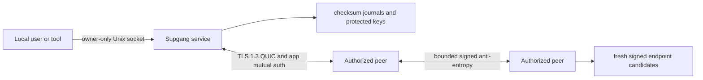

# ADR 0001: Sovereign address plane

Status: accepted for M1, later milestones remain provisional

Date: 2026-08-16

## Decision

Supgang is an identity-to-endpoint control plane, not a VPN, DNS service, remote-access product, or
general message bus. Each authorized device is the sole ordinary writer of a small signed register
describing where it might currently be reached. Authorized devices reconcile those registers over
mutually authenticated QUIC.

Strict mode has no public DHT, DNS publisher, STUN server, hosted control plane, account, telemetry,
or vendor relay. A future introducer or relay must be another instance owned and operated by the
user. Losing every communication edge remains an unrecoverable partition until some edge returns.

The portable implementation is Rust 2024 with Quinn 0.11.11, rustls 0.23.43, and AWS-LC. The earlier
`noq` spike proposal was rejected for M1: its young and experimental NAT extensions did not justify
shipping the larger, less established transport graph before the signed address plane itself had
been proven. Supgang owns its records and protocol, so a later measured transport experiment does
not require changing durable state.

## Implemented system shape

One unprivileged `supgang` binary has two roles:

- `supgang run` owns mutable state and the QUIC endpoint in the foreground.
- CLI commands use a mode-0600 Unix socket and same-UID peer credentials while the service runs.

Without a running service, a command acquires the same exclusive state lock before mutation. There
is no TUN device, privileged daemon, helper process, or shell-owned business logic.

## Identity and authorization

- A random Ed25519 root creates the self-certifying `HiveId`.
- Each computer generates its own Ed25519 device key and derives a stable `NodeId` from the public
  key.
- A membership certificate binds hive, device key, serial, issuance, expiry, role, and a random
  admission nonce under the root signature.
- The joining computer creates and signs its request. Its private key never enters the request or
  response bundle.
- The root-authority computer persists membership issuance before exporting a bundle.
- Revocation is a complete root-signed, sorted, monotonic set. Equal-serial differences are root
  equivocation. A newer set may not remove a revoked identity or move issuance time backward.
- Ordinary M1 administration remains on the founder because delegated administration and root-key
  recovery are not implemented.

The root key is stored only on the founder in this milestone. It is not yet hardware-backed or
offline by default, which is an explicit residual risk.

## Endpoint register

An endpoint record contains:

| Field | Meaning |
| --- | --- |
| `protocol_version` | Exact schema and downgrade boundary. |
| `hive_id`, `node_id` | Cross-hive and signer binding. |
| `transport_key_id` | Hash pin of the current TLS certificate. |
| `generation`, `sequence` | Monotonic register position. |
| `issued_at`, `expires_at` | Bounded freshness. |
| `candidates` | At most eight typed QUIC socket candidates. |
| `capabilities` | Versioned authorization-compatible bitset. |
| `signature` | Domain-separated Ed25519 signature over canonical bytes. |

M1 supports local, direct global, and authenticated-peer-observed reflexive candidates. Candidate
types have strict address-scope checks. A peer-observed socket is an address hint only; the target
still has to prove its membership, device signature, transport pin, and TLS exporter binding.

Merge is deterministic:

1. Verify canonical encoding, membership, signature, hive, node, generation, size, and time bounds.
2. Keep the greatest sequence in one generation.
3. Retain an older record only as a dial hint, never as a successful resolution.
4. Treat equal generation and sequence with different signed content as equivocation. Preserve one
   conflicting record as evidence and stop automatic use.
5. Reject generation changes until a separate root-authorized transition exists.

The local sequence is appended and synchronized before the corresponding signed record is returned.
A whole-disk rollback can still restore the journal and keys together; M1 has no external rollback
witness or generation-recovery command.

## Transport and session

- TLS is restricted to 1.3. Client and server early data are disabled.
- The server presents a self-signed transport certificate whose hash is committed in the device's
  signed endpoint record.
- Each side then signs a session challenge containing both contacts, both nonces, the TLS exporter,
  and peer-observed socket addresses. This supplies mutual device authentication above server-only
  TLS.
- Every frame and nested object has an independent size and count limit.
- The transport permits four bidirectional streams and two unidirectional control streams per
  connection, with 64 KiB stream and 256 KiB connection receive windows.
- At most eight authenticated neighbors and 32 pending peer events are retained.
- For each node pair, the lower `NodeId` is the canonical dialer. The other side accepts. This
  removes simultaneous application-handshake livelock and duplicate sessions without a coordinator.

Rustls with AWS-LC is configured to prefer its post-quantum hybrid group. Ed25519 membership and
device signatures remain classical, so Supgang is not fully post-quantum.

## Reconciliation and revocation

M1 uses rotating pages rather than a general gossip framework. Each authenticated exchange carries
at most eight contacts plus the latest root-signed revocation snapshot. Pages repeat safely and all
contacts are independently verified before a durable import.

When a newer revocation snapshot is committed, the service pushes it immediately on a one-way QUIC
control stream to established peers and waits for transport acknowledgement within two seconds.
The revoked connection is then closed. A target that learns its own valid revocation persists it,
exits with a distinct error, and refuses readiness on restart.

Invalid peer content is connection-local. Invalid canonical data or signatures close that peer.
Filesystem and journal failures are process-fatal because continuing would violate durability.
Valid root equivocation or rollback is also fatal and requires operator investigation.

## Storage and local control

State uses purpose-built append-only journals instead of the proposed redb dependency:

- fixed magic and bounded frame length;
- SHA-256 checksum per frame;
- synchronized append before publication;
- recovery only for a partial final frame;
- fail-closed behavior for corruption before the tail;
- atomic peer-cache compaction through owner-only replacement, file sync, rename, and parent sync;
- owner, type, permission, and symlink checks;
- one process lock for mutable state.

The local control socket uses fixed bounded requests and a 64 KiB JSON response ceiling. The kernel
peer UID must equal the service UID. This protects against other local users but not malware already
running as the owner.

## Failure model

Supgang can converge only while some usable edge crosses every relevant partition. M1 tries:

1. the established authenticated connection;
2. fresh signed local or direct candidates;
3. historically authenticated remembered candidates;
4. new candidates learned through another reachable member.

There is no M1 multicast rendezvous, automatic router mapping, public address oracle, coordinated
hole punching, or relay. An operator must explicitly seed at least one contact path.

## Milestones

### M1: implemented direct kernel

- identity, membership, recipient-bound offline join, and revocation;
- canonical signed endpoint records and deterministic merge;
- durable state, peer cache, local control, and foreground service;
- pinned QUIC, mutual application authentication, bounded reconciliation, and direct candidates;
- macOS live two-process validation and repository quality gate.

### M2: local and changing networks

- privacy-preserving encrypted LAN rendezvous;
- platform network-change notification and prompt record refresh;
- multi-candidate racing, measured backoff, and stronger observation provenance;
- generation recovery with rollback handling.

### M3: difficult wide-area paths

- measured QUIC address discovery and NAT traversal experiment;
- explicit PCP or NAT-PMP policy with safe teardown;
- user-owned introduction and constrained relay;
- topology cut analysis and honest resilience reporting.

### M4: release engineering

- Keychain and Linux protected-key providers;
- LaunchAgent and systemd user packages, manpage, and completions;
- Linux and macOS architecture matrix, fuzzing, and load tests;
- signed reproducible artifacts, checksums, provenance, and upgrade policy.

## Consequences

Positive:

- Identity remains stable while addresses change.
- The current binary has no proprietary or hosted runtime dependency.
- A small signed-register protocol replaces consensus, a public DHT, and a VPN data plane.
- Failures, stale data, equivocation, and revocation remain visible.

Costs:

- M1 requires explicit bootstrap and at least one surviving path.
- Deterministic dial direction can lose a path in an unusually asymmetric firewall policy; future
  coordinated traversal must retain duplicate suppression without assuming symmetric reachability.
- The founder's file-protected online root is not the desired final key posture.
- Direct peers learn network addresses and relationship metadata by design.
