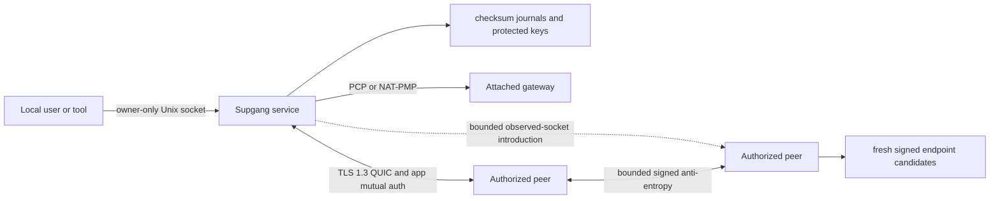

# ADR 0001: Sovereign address plane

Status: corrective wide-area work in progress; physical WAN acceptance has not passed

Date: 2026-08-16

## Decision

Supgang is an identity-to-endpoint control plane, not a VPN, DNS service, remote-access product, or
general message bus. Each authorized device is the sole ordinary writer of a small signed register
describing where it might currently be reached. Authorized devices reconcile those registers over
mutually authenticated QUIC.

Strict mode has no public DHT, DNS publisher, STUN server, hosted control plane, account, telemetry,
or vendor relay. Automatic mode may ask the attached local gateway for a UDP mapping through PCP or
NAT-PMP. Any authenticated member can coordinate a direct-path attempt between two other
connected members, and an explicit anchor mode lets one user-owned instance retain more such
connections. A future control relay must also be owned and operated by the user. Losing every
communication edge remains an unrecoverable partition until some edge returns.

The portable implementation is Rust 2024 with Quinn 0.11.11, rustls 0.23.43, and AWS-LC. The earlier
`noq` spike proposal was rejected for M1: its young and experimental NAT extensions did not justify
shipping the larger, less established transport graph before the signed address plane itself had
been proven. Supgang owns its records and protocol, so a later measured transport experiment does
not require changing durable state.

## Implemented system shape

One unprivileged `supgang` binary has three runtime roles:

- `supgang run` owns mutable state and the QUIC endpoint. It can run directly in the foreground or
  under the native per-user service installed by `supgang service install`.
- `supgang anchor` runs the same authenticated protocol as a user-owned meeting point with a fixed
  64-neighbor ceiling. It accepts inbound sessions and participates in bounded synchronized
  outbound recovery. `supgang service install --anchor` installs that role.
- CLI commands use a mode-0600 Unix socket and same-UID peer credentials while the service runs.

Without a running service, a command acquires the same exclusive state lock before mutation. There
is no TUN device, privileged daemon, helper process, or shell-owned business logic.

## Identity and authorization

- A random Ed25519 root creates the self-certifying `HiveId`.
- Each computer generates its own Ed25519 device key and derives a stable `NodeId` from the public
  key.
- A membership certificate binds hive, device key, serial, issuance, expiry, role, and a random
  admission nonce under the root signature.
- The joining computer creates and signs its request. Its private key never enters the request or
  response bundle.
- The root-authority computer persists membership issuance before exporting a bundle.
- Revocation is a complete root-signed, sorted, monotonic set. Equal-serial differences are root
  equivocation. A newer set may not remove a revoked identity or move issuance time backward.
- Ordinary M1 administration remains on the founder because delegated administration and root-key
  recovery are not implemented.

The root key is stored only on the founder in this milestone. It is not yet hardware-backed or
offline by default, which is an explicit residual risk.

## Endpoint register

An endpoint record contains:

| Field | Meaning |
| --- | --- |
| `protocol_version` | Exact schema and downgrade boundary. |
| `hive_id`, `node_id` | Cross-hive and signer binding. |
| `display_name` | Device-signed human label; never an authorization identity. |
| `transport_key_id` | Hash pin of the current TLS certificate. |
| `generation`, `sequence` | Monotonic register position. |
| `issued_at`, `expires_at` | Bounded freshness. |
| `candidates` | At most eight typed QUIC socket candidates. |
| `capabilities` | Versioned authorization-compatible bitset. |
| `signature` | Domain-separated Ed25519 signature over canonical bytes. |

The current tree supports local, direct public, local-gateway-mapped, and
authenticated-peer-observed reflexive candidates. Active non-loopback interface addresses are
discovered from the local kernel without network egress. Explicitly owner-enabled router mapping sends bounded PCP
or NAT-PMP requests only to the attached gateway; UPnP is disabled. Private and non-global addresses
are local. Globally routed interface addresses and scope-checked gateway mapping results are public
candidates. Gateway-driven signed updates are limited to four per five minutes and remain visibly
unverified until an authenticated peer independently reports the socket. An owner-only explicit
configuration can replace automatic discovery. Candidate types have strict address-scope checks.
Every mapped or peer-observed socket remains only a dial hint; the target still has to prove its
membership, device signature, transport pin, and TLS exporter binding.

Endpoint record v2 adds a bounded portable ASCII display name under a new signature domain. The
decoder continues to verify v1 records under the v1 domain, using a fingerprint-derived fallback
label until the peer publishes v2. A name change advances the endpoint sequence and does not require
root re-enrollment. Names never participate in membership, merge authority, transport pinning, or
revocation. Human output always pairs a name with a stable fingerprint, and ambiguous name lookup
fails closed.

Merge is deterministic:

1. Verify canonical encoding, membership, signature, hive, node, generation, size, and time bounds.
2. Keep the greatest sequence in one generation.
3. Retain an older record only as a dial hint, never as a successful resolution.
4. Treat equal generation and sequence with different signed content as equivocation. Preserve one
   conflicting record as evidence and stop automatic use.
5. Reject generation changes until a separate root-authorized transition exists.

The local sequence is appended and synchronized before the corresponding signed record is returned.
A fixed-size checksummed head witness binds each committed journal length, frame count, and prefix
digest. Reopening detects committed-tail truncation and permits recovery only for bytes beyond the
last witnessed prefix. A whole-disk rollback can still restore the journal, witness, and keys
together; M1 has no external monotonic witness or generation-recovery command.

## Transport and session

- TLS is restricted to 1.3. Client and server early data are disabled.
- The server presents a self-signed transport certificate whose hash is committed in the device's
  signed endpoint record.
- Each side then signs a session challenge containing both contacts, both nonces, the TLS exporter,
  and peer-observed socket addresses. This supplies mutual device authentication above server-only
  TLS.
- Every frame and nested object has an independent size and count limit.
- The transport permits four bidirectional streams and two unidirectional control streams per
  connection, with 64 KiB stream and 256 KiB connection receive windows.
- At most eight authenticated neighbors in device mode or 64 in explicit anchor mode, eight pending
  inbound and eight separately reserved outbound session tasks, 16 short-lived peer-recovery
  intents, and 32 pending peer events are retained. Native IPv6 sources share a `/64` admission
  budget; IPv4 sources, including mapped aliases, share a single-address budget.
- For each node pair, the lower `NodeId` is the canonical dialer and retries every round. The other
  side makes one recovery probe per four rounds. Retry boundaries are derived from the hive and wall
  clock so two members can transmit in the same NAT binding window. Up to four ranked addresses are
  raced with 125 ms spacing. Both endpoints retain a reverse-direction connection as a temporary
  fallback; a preferred connection replaces it deterministically. The same rule lets devices hold
  outbound-created anchor sessions without duplicate-session livelock.
- On an authenticated session, a member may request an introduction to another member currently
  connected to the same process. The introducer sends each side only the remote socket observed on
  the other's authenticated QUIC connection. Both sides try the socket from their existing bound
  endpoint. The attempt still requires the expected transport pin and mutual device proof.
- An observed-socket offer is a canonical datagram capped at 256 bytes. It is ignored unless the
  receiver independently attempted that named peer in the last 30 seconds, and the first accepted
  offer consumes that intent. Only globally routed sockets can enter the attempt scheduler; private,
  loopback, link-local, invalid, future-version, repeated, unsolicited, and excess offers do not
  change durable state.

Rustls with AWS-LC is configured to prefer its post-quantum hybrid group. Ed25519 membership and
device signatures remain classical, so Supgang is not fully post-quantum.

## Reconciliation and revocation

M1 uses rotating pages rather than a general gossip framework. Each authenticated exchange carries
at most eight contacts plus the latest root-signed revocation snapshot. Pages repeat safely and all
contacts are independently verified before a durable import.

Newer revocation snapshots are prioritized in every bounded authenticated anti-entropy page and on
the paced revocation intake stream. No detached fanout task is created per peer. The revoked local
connection is invalidated immediately. A target that learns its own valid revocation persists it,
exits with a distinct error, and refuses readiness on restart.

Invalid peer content is connection-local. Invalid canonical data or signatures close that peer.
Filesystem and journal failures are process-fatal because continuing would violate durability.
Valid root equivocation or rollback is also fatal and requires operator investigation.

## Storage and local control

State uses purpose-built append-only journals instead of the proposed redb dependency:

- fixed magic and bounded frame length;
- SHA-256 checksum per frame;
- synchronized append before publication;
- recovery only for a partial final frame;
- fail-closed behavior for corruption before the tail;
- atomic peer-cache compaction through owner-only replacement, file sync, rename, and parent sync;
- descriptor-based owner, type, mode, extended-ACL, and symlink checks;
- a bounded mode-0600 endpoint JSON file, keeping peer addresses out of process arguments and
  ordinary startup output;
- one process lock for mutable state.

The local control socket uses fixed bounded requests and a 64 KiB JSON response ceiling. The kernel
peer UID must equal the service UID. This protects against other local users but not malware already
running as the owner.

## Failure model

Supgang can converge only while some usable edge crosses every relevant partition. The current tree
tries:

1. the established authenticated connection;
2. fresh signed local or direct candidates;
3. a globally routed UDP mapping returned by the attached gateway;
4. historically authenticated remembered candidates;
5. a synchronized bilateral attempt to the same remembered candidates;
6. observed sockets exchanged through a mutually authenticated connected member;
7. signed records and introductions through an explicit user-owned anchor.

There is no public address oracle, public rendezvous service, general traffic relay, or guaranteed
hard-NAT traversal. Router mapping cannot cross CGNAT, cannot open every host firewall, and depends
on local gateway support. Peer-assisted traversal needs both targets to remain connected to at
least one common member and still fails on some endpoint-dependent NATs or UDP-blocking networks.
An anchor avoids changes to each edge router only when the anchor itself already has a reachable
path. An operator must still seed the initial signed contacts.

## Milestones

### M1: implemented direct kernel, failed primary WAN acceptance

- identity, membership, recipient-bound offline join, and revocation;
- canonical signed endpoint records and deterministic merge;
- signed display names and no-egress local interface address discovery;
- durable state, peer cache, local control, and foreground service;
- pinned QUIC, mutual application authentication, bounded reconciliation, and direct candidates;
- macOS live two-physical-host validation on one local network and repository quality gate;
- failed Laptop A-to-Home B rerun after Laptop A moved outside that network.

### Corrective WAN gate: implemented in source, physical acceptance pending

- automatic renewable PCP and NAT-PMP UDP mapping with network-change replacement, rate-limited
  signed hints, explicit unverified provenance, and orderly release;
- separate signed-address validity from current authenticated connection state in human, JSON, and
  MCP output;
- ranked candidate racing, hive-synchronized bilateral retries, authenticated observed-socket
  introduction, and an explicit bounded user-owned anchor role;
- pass an installed-build Laptop A-to-Home B rerun from separate networks before release.

### M2: local and changing networks

- privacy-preserving encrypted LAN rendezvous;
- platform network-change notification and prompt record refresh;
- measured path quality and stronger observation provenance;
- generation recovery with rollback handling.

### M3: difficult wide-area paths

- measured hard-NAT port prediction and NAT64 experiment;
- user-owned constrained control relay for networks that block direct UDP;
- topology cut analysis and honest resilience reporting.

### M4: release engineering

- Keychain and Linux protected-key providers;
- distributable service packages, manpage, and completions;
- Linux and macOS architecture matrix, fuzzing, and load tests;
- production TUF threshold-key ceremony, signed reproducible artifacts, provenance, and
  cross-platform physical acceptance for the implemented locally pinned verifier, peer carriage,
  and atomic A/B supervisor specified in `docs/security/secure-updates.md`.

## Consequences

Positive:

- Identity remains stable while addresses change.
- The current binary has no proprietary or hosted runtime dependency.
- A small signed-register protocol replaces consensus, a public DHT, and a VPN data plane.
- Failures, stale data, equivocation, and revocation remain visible.

Costs:

- The system requires explicit bootstrap and at least one surviving or newly reachable path.
- A one-way firewall can still block the only currently reachable direction. Secondary recovery
  probes and router mapping reduce dependence on symmetry but cannot create a path through a host
  firewall or CGNAT.
- The founder's file-protected online root is not the desired final key posture.
- Direct peers learn network addresses and relationship metadata by design.
